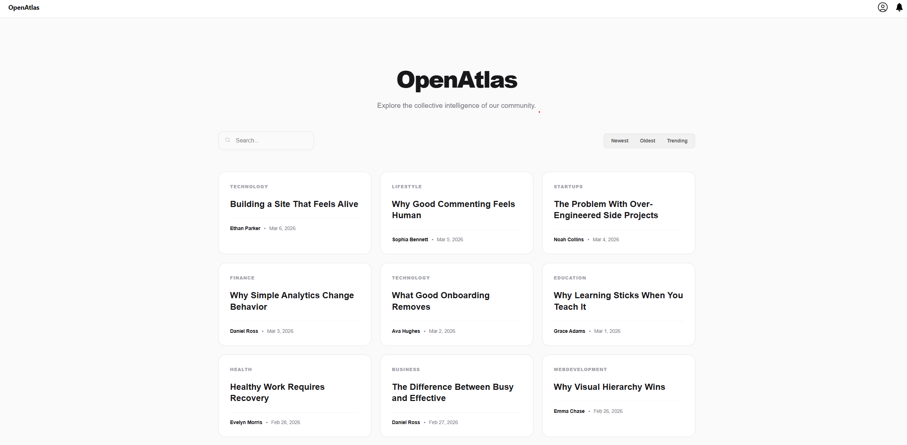
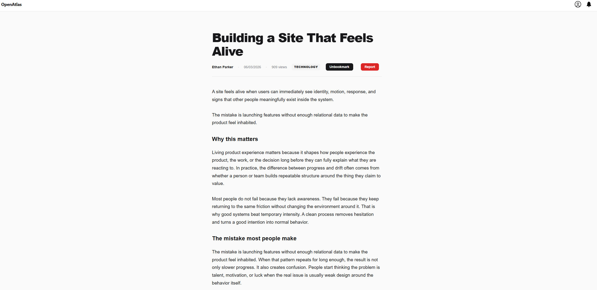
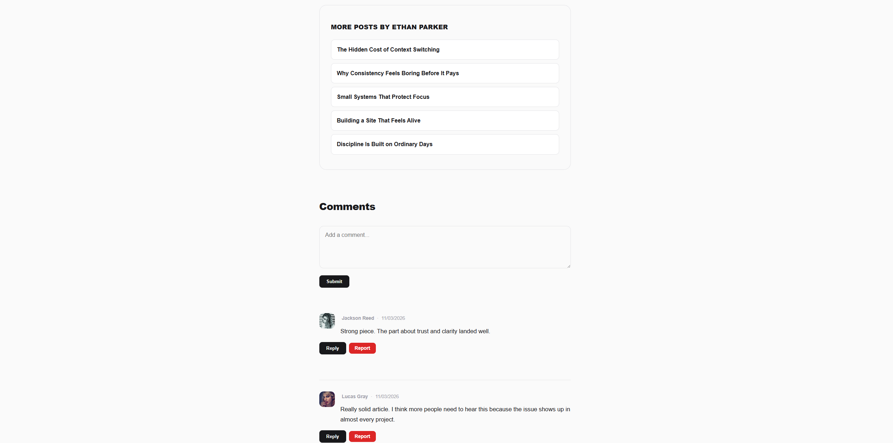
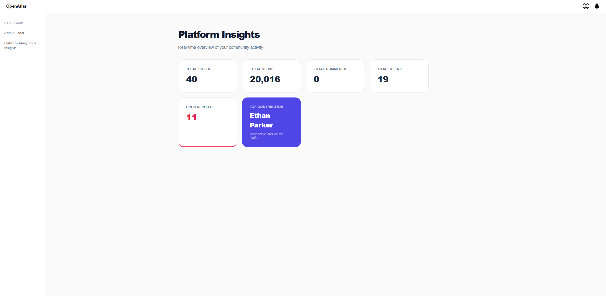
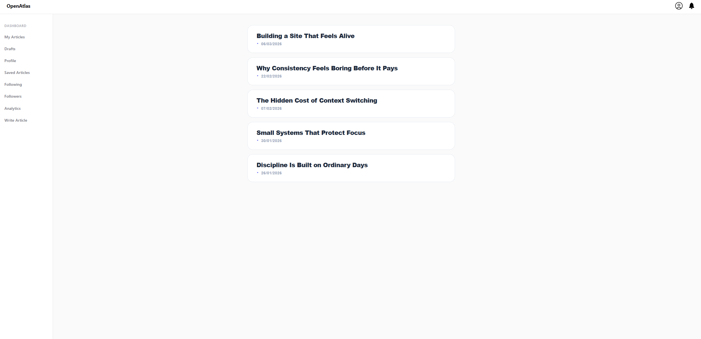
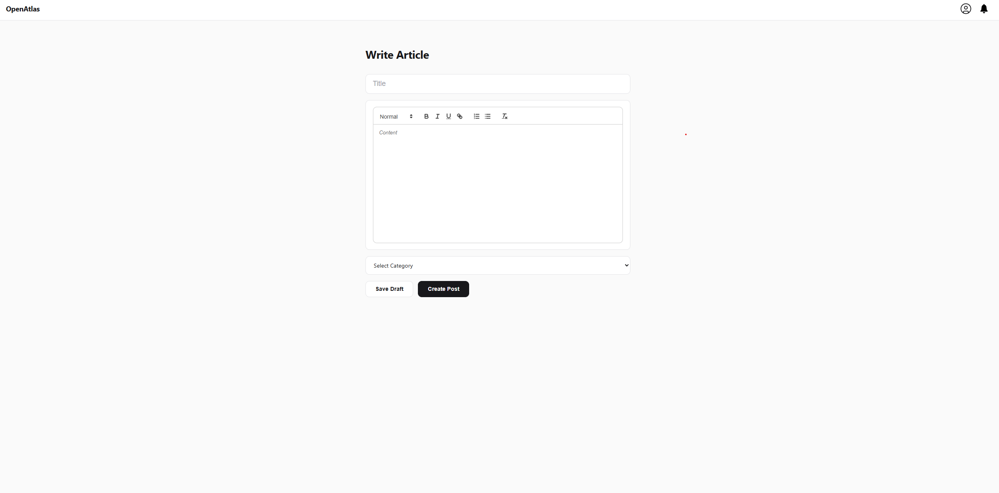

# OpenAtlas

OpenAtlas is a full-stack publishing platform that allows users to write, share, and interact with articles.

The goal of this project was to build something that feels like a real product  not just a CRUD app  including user interaction, analytics, and an admin system.

---

## Live Demo

https://open-atlas-bn4w.vercel.app/ 

Test User  
Username: ethanparker  
Password: DemoPass123!  

Admin  
Username: admin  
Password: DemoPass123!  

Use the admin account to access platform analytics and admin panel.

---

## Screenshots

### Home

### Article

### Comments

### Admin Dashboard

### Dashboard

### Editor

---

## Features

- User authentication (login, signup, session-based)
- Create and publish articles using a rich text editor
- Comment and reply system
- Bookmark articles for later reading
- Report content (posts and comments)
- Notification system (e.g. when someone replies or interacts)
- Trending posts logic based on activity
- Personal dashboard with analytics
- Admin panel with platform-level insights
- Follow system between users
---

## Tech Stack

Frontend  
- React (Vite)  
- CSS Modules  
- Axios  

Backend  
- Node.js  
- Express  
- Prisma ORM  
- PostgreSQL (Neon)  

Deployment  
- Vercel (frontend)  
- Render (backend)  

---

## Architecture

The application is built as a REST API using Express, with Prisma handling all database interactions.

Authentication is session-based using cookies.

The backend is structured into controllers, routes, and services to keep logic separated and maintainable.

The frontend communicates with the API through Axios and is organized by pages and reusable components.

---

## Demo Data

The project includes seeded data to simulate a real environment:

- ~20 users  
- ~40 articles  
- comments and replies  
- followers  
- analytics data  

---

